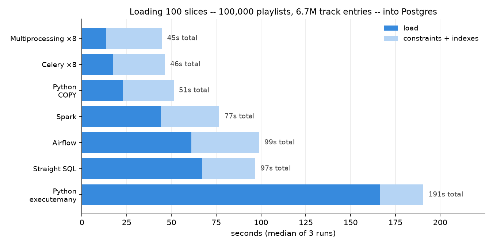

# Loading the Spotify Million Playlist Dataset, seven ways

Seven implementations of the same job — take 1,000 JSON files (31 GB, 1M playlists,
66M track entries) and load them into a normalized Postgres schema — benchmarked
against each other and against the same validation checks.

The interesting part isn't which is fastest. It's that each approach solves the
*same* problem — deduplicating 66M track entries down to 2.26M unique tracks — a
different way, and that the right answer changes the moment you add a second worker.

## The data

Each slice file is one JSON object containing 1,000 playlists, each containing an
ordered list of tracks. Every track entry repeats its artist and album name inline:

```json
{"playlists": [{
  "pid": 0, "name": "Throwbacks", "collaborative": "false", "modified_at": 1493424000,
  "num_tracks": 52, "num_followers": 1, "duration_ms": 11532414,
  "tracks": [{
    "pos": 0,
    "track_uri":  "spotify:track:0UaMYEvWZi0ZqiDOoHU3YI", "track_name": "Lose Control",
    "album_uri":  "spotify:album:6vV5UrXcfyQD1wu4Qo2I9K", "album_name": "The Cookbook",
    "artist_uri": "spotify:artist:2wIVse2owClT7go1WT98tk", "artist_name": "Missy Elliott",
    "duration_ms": 226863
  }]
}]}
```

| | count |
|---|---:|
| playlists | 1,000,000 |
| track entries | 66,346,428 |
| unique tracks | 2,262,292 |
| unique albums | 734,684 |
| unique artists | 295,860 |

66M entries collapse to 2.26M tracks — every track appears ~29 times on average, and
the most popular ("HUMBLE." by Kendrick Lamar) appears 46,574 times. **That ratio is
the whole problem.**

## The schema

Spotify URIs are natural keys — globally unique, stable identifiers — so no surrogate
IDs are needed. `artist_uri` lives on `albums` rather than `tracks` because a track's
artist is determined by its album; storing it on both would be a 3NF violation.

```
artists ──1:N──▶ albums ──1:N──▶ tracks ◀──N:M──▶ playlists
                                      playlist_tracks
```

```sql
artists          (artist_uri PK, name)
albums           (album_uri PK, name, artist_uri FK)
tracks           (track_uri PK, name, album_uri FK, duration_ms)
playlists        (pid PK, name, description, collaborative, modified_at, num_* , duration_ms)
playlist_tracks  (pid FK, pos, track_uri FK, PRIMARY KEY (pid, pos))
```

`playlist_tracks` is 95% of the bytes and has *no* dedup problem — `(pid, pos)` is
unique by construction. All the difficulty lives in the three small dimension tables.

## The bulk-load pattern

Every loader runs the same four phases, and only phase 2 differs:

```
1. reset       drop and recreate BARE tables -- no PKs, no FKs, no indexes
2. load        <-- the seven variants
3. constraints ALTER TABLE ... ADD PRIMARY KEY / FOREIGN KEY, then CREATE INDEX
4. validate    row counts must match the dataset's published stats
```

Constraints go on *after* the data. A foreign key declared up front costs an index
probe per row — ~200M probes across the load. Added afterwards, it's one hash join
over the whole table. Same for indexes: a bulk build is one sort, not 66M incremental
B-tree insertions.

Phase 3 is also a **control**: every loader produces identical tables, so its duration
should be identical too. It is -- 41-44 s for every loader except 02, which comes in at
35 s because it already built the three dimension primary keys during its load. The
control isolates a real structural difference rather than noise.

## The seven loaders

| # | approach | how it dedups | why that |
|---|---|---|---|
| 01 | Straight SQL | staging table + `GROUP BY` | SQL is built for set operations |
| 02 | Python, `executemany` | `ON CONFLICT DO NOTHING` | naive baseline; let the DB referee |
| 03 | Python, `COPY` | in-memory `set` of seen URIs | one process, so a set is authoritative |
| 04 | `ProcessPoolExecutor` | staging + `GROUP BY` | processes share nothing; a set breaks |
| 05 | Celery + Redis | staging + `GROUP BY` | same, now across machines |
| 06 | Airflow (CeleryExecutor) | staging + `GROUP BY` | same work, orchestrated |
| 07 | Spark | `dropDuplicates` (a shuffle) | dedup happens outside Postgres entirely |

**The dedup strategy is a function of how many writers there are.** One writer can
remember what it has seen. Two cannot — so either the database referees (`ON CONFLICT`,
needing a unique index and paying for it on every row) or you stop coordinating
entirely: let workers append duplicates to unconstrained staging tables and collapse
them once, at the end, with a single parallel hash aggregate.

## Results

### 100 slices (100,000 playlists, 6.7M track entries)



| loader | load (s) | constraints (s) | total (s) | rows/s | runs |
|---|---:|---:|---:|---:|---:|
| Multiprocessing | 13.7 | 31.0 | 44.7 | 487,431 | 3 |
| Celery | 17.4 | 29.0 | 46.4 | 383,782 | 3 |
| Python, COPY | 22.9 | 28.4 | 51.3 | 291,607 | 3 |
| Spark | 44.1 | 32.6 | 76.7 | 151,424 | 3 |
| Airflow | 61.2 | 37.8 | 99.0 | 109,114 | 3 |
| Straight SQL | 67.1 | 29.7 | 96.8 | 99,520 | 3 |
| Python, executemany | 166.6 | 24.0 | 190.6 | 40,083 | 3 |

Median of 3 runs, all seven loaders, one session, on a MacBook Air (8 cores, 16 GB).

### Full dataset (1,000,000 playlists, 66,346,428 track entries)

| loader | load (s) | constraints (s) | total (s) | rows/s | runs |
|---|---:|---:|---:|---:|---:|
| Multiprocessing | 137.4 | 289.2 | 426.6 | 482,871 | 1 |
| Celery | 156.1 | 294.1 | 450.2 | 425,025 | 1 |
| Python, COPY | 235.5 | 270.0 | 505.5 | 281,726 | 1 |

Single run of the three fastest. The interesting number is not the total but the
**scaling**: multiprocessing went from 13.7 s at 100 slices to 137.4 s at 1,000 --
exactly linear, 487K to 483K rows/sec. Chunked staging is what keeps it that way;
without it, staging would have grown to ~8 GB and the final dedup would have had to
read all 66M duplicate rows instead of ~7M pre-combined ones.

The constraints phase scaled at 9.3x for 10x the rows, which is better than the
n log n an index build implies -- `maintenance_work_mem` was large enough to keep
most of the sorting in memory.

Final database: **7.5 GB**, 66,346,428 fact rows, 2,262,292 tracks.

## What each loader taught

### 01 — Straight SQL

Postgres reads the files itself with `pg_read_file()`, parses to `jsonb`, and flattens
with `jsonb_array_elements()`. No client-side parsing at all; `psql` only ships SQL text.

The lesson was in the dedup. `SELECT DISTINCT ON (track_uri)` forces a full sort —
"first row per key" is only meaningful if rows are ordered. Rewriting it as
`GROUP BY track_uri` with `min(name)` says "any row will do", which frees the planner
to use a parallel hash aggregate:

```
DISTINCT ON:   Unique → Sort (quicksort, 52MB) → Seq Scan                       1.67s
GROUP BY:      Finalize GroupAggregate → Gather Merge (2 workers)
                 → Sort → Partial HashAggregate → Parallel Seq Scan             0.67s
```

Same result, 2.5× faster, because one formulation permits parallelism and the other
doesn't. `EXPLAIN (ANALYZE)` is how you find this out — my first guess at the
bottleneck (double JSON parsing) was worth 2 seconds; this was worth 10.

### 02 — Python, `executemany`

The version most people write first, and the slowest thing here by an order of
magnitude. Every row is its own SQL statement: parse, plan, execute, reply. It also
needs unique indexes to exist *during* the load for `ON CONFLICT` to detect conflicts
against — so it pays per-row index maintenance on top.

### 03 — Python, `COPY`

Identical parsing, but rows stream to Postgres through the `COPY` protocol: one
command, then raw tab-separated bytes. No per-row SQL parsing, planning, or reply.
~10× faster than 02 on the same data structures.

With one process, an in-memory `set` of seen URIs is authoritative, so no unique index
is needed at all. Profiling after this change showed the bottleneck had moved to
Python: of 0.39 s/slice, 0.23 s was `json.loads` plus the flattening loop and only
0.16 s was Postgres. **Fix the bottleneck and it moves somewhere else.**

### 04 — Multiprocessing

CPU-bound Python work does not parallelize with threads -- the GIL lets only one
thread execute bytecode at a time. Processes get real cores, at the cost of sharing
nothing: each worker has its own `seen` set, so loader 03's dedup strategy is dead.
Workers append to unconstrained staging tables instead and never coordinate.

**Bounding the working set.** Staging absorbs every duplicate, so loading all 1,000
slices before collapsing would put ~8 GB of soon-to-be-discarded rows on disk. The
loader processes slices in chunks and merges after each one, which makes peak disk
independent of dataset size.

The first version of that merge deduped straight into the real dimension tables,
which required their primary keys to exist during load so `ON CONFLICT` could detect
conflicts. It was **2.7x slower overall** (50.7 s vs 18.6 s) -- the merge alone went
from 1.6 s to 9.0 s on identical data, because per-row index maintenance replaced one
bulk index build.

The fix was **two-level aggregation**: each chunk is collapsed into unindexed
`*_merged` tables, and cross-chunk duplicates are left for a single final pass. Same
idea as a MapReduce combiner, or Spark's `Partial HashAggregate` before a shuffle --
reduce locally so the expensive global step reads less. The result was faster than the
original unchunked version (13.7 s) *and* bounded in disk, because the final dedup now
reads ~7M pre-combined rows instead of 66M raw ones.

**The infrastructure finding.** Early runs showed no speedup beyond 4 workers. The
ceiling turned out to be Docker Desktop's VM on macOS, which funnels all container
traffic through a virtualized network stack. Moving Postgres to a native Homebrew
install (see `pg.sh`) restored linear scaling. Measure your infrastructure before
blaming your code.

### 05 — Celery

Same worker function, dispatched through a Redis queue instead of OS pipes. On one
laptop this is strictly slower than 04 — the parallel phase is nearly identical
(8.5 s vs 7.5 s at 100 slices), and the difference is fixed startup cost.

What it buys is not speed: the producer can enqueue and exit, workers can live on any
machine that can reach the broker, and unacknowledged messages survive a worker's
death. That last one requires tasks to be **idempotent** — this one checks whether its
slice's first `pid` already exists and returns early if so, which is safe because each
slice commits atomically.

### 06 — Airflow

The same function again, as a DAG:

```
create_staging → list_slices → load_slice[×N] → finalize → validate
```

`load_slice` uses dynamic task mapping (`.expand()`) to generate one task instance per
slice at runtime. It is ~6× slower than Celery running identical code, because every
task walks a state machine whose transitions are rows in a metadata database, and the
scheduler polls that database to decide what's runnable.

What the overhead buys is everything that happens *after* the run: per-task logs,
run history, a Gantt chart, and one-click re-run of a single failed slice (and only
its downstream). Celery scales the work; Airflow manages the workflow.

### 07 — Spark

The only loader where flattening and deduplication happen outside Postgres. Spark
parses the JSON, `explode()`s the nesting, and `dropDuplicates()` across its own
workers, handing Postgres five finished tables over JDBC.

`dropDuplicates` is a **shuffle**: Spark hashes `track_uri` and routes every row with
that hash to the same partition, so all 46,574 copies of "HUMBLE." meet on one worker
and collapse locally. It's the same algorithm as Postgres's hash aggregate, distributed.

Profiling at 100 slices was the surprise:

| phase | time |
|---|---:|
| JVM + session startup | ~4 s |
| read + explode 6.7M rows | 17.0 s |
| **dropDuplicates (the shuffle)** | **2.5 s** |
| JDBC write, 6.7M rows | 8.5 s |

The famously expensive shuffle is the cheapest step. At this scale on one machine,
Spark's distributed machinery is overhead rather than benefit — the shuffle only hurts
when it crosses a network. JDBC is also Spark's weak point against Postgres: it issues
batched `INSERT`s, not `COPY`. In production you would write Parquet to object storage
and let the warehouse ingest it.

## Reading the benchmark honestly

These numbers describe **one laptop** (M-series MacBook Air, 8 cores, 16 GB RAM,
Postgres 16 with `shared_buffers=2GB` and `synchronous_commit=off`). They are not a
statement about the tools.

- **Celery, Airflow, and Spark are not designed to win this.** Their value is
  horizontal scale, operability, and handling data that doesn't fit on one machine.
  On a single laptop those properties are pure overhead, and the timings show exactly
  that. A benchmark that concluded "Airflow is bad" would be misreading its own data.
- **Everything shares one Postgres.** Past ~8 concurrent writers the database, not the
  loader, is the constraint. Loaders 04–07 are measuring the same ceiling.
- **Docker on macOS taxes network I/O.** Loaders 05 and 06 run services in containers;
  loader 06's workers are containerized too. Part of their cost is the VM, not the tool.
- **Every figure is the median of 3 runs**, and the spread differs sharply by loader.
  The five that need no external services agreed to within ~2% across repetitions.
  Celery varied ~13%. Airflow varied ~57% (159.6 / 130.2 / 101.4 s), getting faster
  each repetition as containers and caches warmed -- its timing depends on scheduler
  poll intervals and on five containers competing for the same laptop. Treat the
  Airflow figure as an order of magnitude, not a measurement.
- **Loader 02 is deliberately naive.** It exists as a baseline, not as a
  recommendation.
- **Precision is not accuracy.** An earlier sweep had 3 reps per loader agreeing to
  within 2%, and was still wrong: each loader's reps ran in one session, so a
  session-level change shifted all three together and showed up as tight variance
  rather than as error. Re-running an *unmodified* loader later gave 23.3 s where it
  had measured 32.5 s -- the machine was ~30% faster once the disk dropped below 96%
  full. The tell was the constraints-phase control diverging between loaders, not the
  variance. Everything in the table above was therefore re-measured in a single
  session, with reps interleaved round-robin so any remaining drift spreads across all
  loaders instead of landing on one. The discarded numbers are kept in
  `results/results_mixed_conditions.csv`.

## Setup

```bash
# 1. Dataset (1,000 slice files) -- anywhere outside the repo
#    https://www.kaggle.com/datasets/himanshuwagh/spotify-million

# 2. Config
cp .env.example .env        # set MPD_DATA_DIR to the directory holding mpd.slice.*.json

# 3. Python
python3 -m venv .venv && .venv/bin/pip install -e . && .venv/bin/pip install pyspark

# 4. Postgres (native -- Docker's VM caps multi-writer throughput on macOS)
brew install postgresql@16
./pg.sh start

# 5. Spark's JDBC driver
mkdir -p jars && curl -sL -o jars/postgresql.jar \
  https://repo1.maven.org/maven2/org/postgresql/postgresql/42.7.4/postgresql-42.7.4.jar
```

Run one loader, or the whole sweep:

```bash
.venv/bin/python benchmark.py --slices 10 03_py_copy     # quick dev run
./run_benchmarks.sh 100 3                                # all seven, 3 reps each
```

Loaders 05 and 06 additionally need Docker (`docker compose up -d redis`, and for
Airflow `docker compose -f loaders/06_airflow/docker-compose.airflow.yml up -d`,
UI at http://localhost:8080, admin/admin). `run_benchmarks.sh` starts and stops these
per group so background containers don't skew the other loaders' timings.

## Repo layout

```
benchmark.py                 harness: reset → load → constraints → validate, timed
run_benchmarks.sh            grouped sweep (services started only for the group that needs them)
pg.sh                        start/stop/psql the native Postgres
schema/
  schema.sql                 bare tables
  constraints.sql            PKs, FKs, index -- applied after load
  staging.sql                unconstrained dimension tables for multi-writer loaders
  finalize_staging.sql       GROUP BY dedup, staging → dimensions
common/
  config.py  parse.py  copy.py  db.py  expected.py
loaders/
  01_sql/  02_py_sequential/  03_py_copy/  04_multiproc/
  05_celery/  06_airflow/  07_spark/
results/
  results.csv  summarize.py
```

Each loader directory contains a `run.sh`. That is the entire interface the harness
knows about: three environment variables in (`DATABASE_URL`, `MPD_DATA_DIR`,
`MPD_SLICES`), an exit code out. It's what lets `psql`, `spark-submit`, a Celery
producer, and an Airflow API call all be "a loader" without the harness caring.

## Known limitations

- **Loader 06 (Airflow) does not chunk its staging.** The DAG maps one task per slice
  and finalizes once, so staging grows with the input and the full 1,000-slice dataset
  would not fit on the machine this was built on. Fixing it means restructuring the DAG
  into sequential chunk groups. Loaders 04 and 05 do chunk, and run at full scale.
- **Loader 01 (straight SQL) cannot run at full scale either**, for a larger reason:
  it materializes every slice as `jsonb` in one table before exploding it, which would
  be ~34 GB before any rows are written.
- **Full-dataset figures are single runs.** The 100-slice table is the one with
  repetitions behind it.
- **`benchmark.py` trusts the dataset's published counts** for full-dataset validation
  and recomputes them by scanning the JSON for partial runs (a few seconds per 100
  slices).
